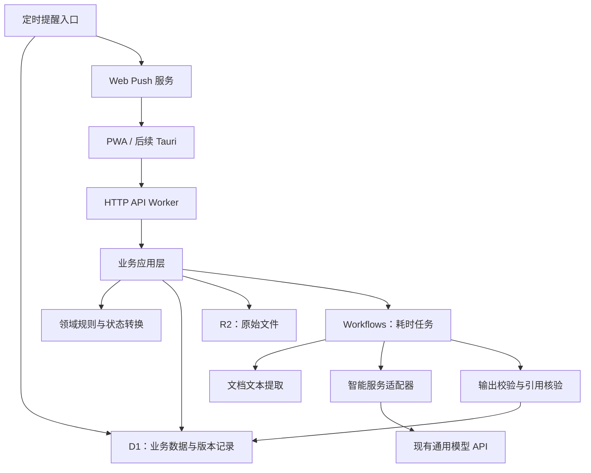

# 实习决策与执行 PWA：功能规格及前后端实施计划

## 一、已确认的交付范围

面向学生提供完整的求职任务工作台，管理员维护公共岗位。本轮交付独立演示站，使用虚构资料和演示身份；前后端均部署在 Cloudflare，后续增加 Tauri 客户端。

**本会话负责前端、接口契约和验证；组员依据本计划实现后端。**

| 功能 | 首版行为 |
|---|---|
| 画像与经历 | 上传 PDF／DOCX 简历，确认解析结果；支持手动补充、修改经历和求职偏好 |
| 技能证据 | 技能关联经历原文；区分待确认、已确认和缺少证据，不把模型推断直接当作事实 |
| 岗位管理 | 管理员维护公共岗位；学生可以粘贴私人 JD 并填写来源链接 |
| 匹配解释 | 展示硬条件、分项评分、优势、差距、准备成本和引用依据；不预测录取概率 |
| 求职组合 | 根据时间预算优先选择单位准备时间收益较高的岗位，同时考虑截止时间 |
| 两周计划 | 生成任务和排期，学生确认后生效；变化产生调整建议，不自动覆盖已确认计划 |
| 简历改写 | 展示原文与建议对照，逐条采纳；不得添加未经确认的经历、数字或成果 |
| 投递跟踪 | 手动维护投递状态、面试安排、结果与反馈；支持实际工时录入和效率统计 |
| 通知 | 站内到期提示，以及用户主动授权后的浏览器推送 |
| 离线操作 | 画像、经历、任务和投递记录可离线修改；冲突展示两个版本，由学生选择 |
| 管理员 | 岗位新增、编辑、解析确认、发布及下架；不包含文章管理 |

首版不包含模拟面试、自动投递、自动发送简历、全网岗位抓取、真实账号注册或 Tauri 打包。

## 二、后端程序架构

### 2.1 部署与代码组织

采用 **TypeScript 模块化后端**，接口层使用 Hono，运行时校验与 OpenAPI 契约使用 Zod。该组合支持 Cloudflare Workers，便于前后端共享字段定义。[Hono 官方文档](https://hono.dev/examples/zod-openapi)

前端和后端分别构建、部署；业务逻辑不进入前端托管 Worker。

后端内部固定分成四层：

- **接口层**：HTTP 路由、身份上下文、权限检查、参数校验、统一错误。
- **应用层**：组织“确认画像”“生成匹配”“采纳计划”等业务操作及事务。
- **领域层**：硬条件判断、评分、预算分配、状态转换、引用与版本规则。
- **基础设施层**：D1、R2、Workflows、模型 API、推送服务适配器。

接口处理器不直接编写评分逻辑；模型适配器不能直接修改学生资料。

### 2.2 模块职责

| 模块 | 负责内容 | 边界 |
|---|---|---|
| 身份与权限 | 提供统一用户上下文和角色检查 | 演示身份不可作为生产认证 |
| 画像与证据 | 目标、经历、技能、原文引用、确认状态 | 修改原文后，相关分析标记为过期 |
| 文档处理 | 文件校验、存储、文本提取、解析草稿 | 解析结果须确认后才能进入正式画像 |
| 岗位 | 公共与私人岗位、JD 版本、条件、来源、发布状态 | 私人岗位不自动进入公共库 |
| 匹配与组合 | 条件判断、评分、差距、准备成本、预算选择 | 模型不能改写规则分数 |
| 计划与改写 | 两周计划、调整建议、简历改写候选 | 生成与采纳是两个独立动作 |
| 投递与统计 | 状态历史、面试记录、反馈、工时 | 面试机会按投递去重统计 |
| 同步 | 操作去重、版本校验、增量同步、删除记录 | 冲突不得静默覆盖 |
| 通知 | 订阅、提醒排程、投递记录、失效订阅清理 | 不在通知正文展示简历或面试反馈 |

### 2.3 存储设计

使用 **D1 保存结构化数据，私有 R2 保存原始文件**。

主要数据组：

- 画像、经历、技能，以及经历与技能的关联。
- 文档、文本片段、来源位置和解析草稿。
- 岗位、JD 版本、要求及原文引用。
- 匹配快照、求职组合、规则版本和输入版本。
- 计划版本、任务、调整建议、简历改写建议。
- 投递、状态事件、面试安排和工时。
- 异步作业、同步操作、变更日志、提醒与推送订阅。

证据图谱采用关系表表达，不引入独立图数据库。首版岗位检索采用结构化筛选和文本搜索，不引入向量数据库。

所有可同步记录包含稳定 ID、所属用户、版本和删除标记。引用保存来源版本、原文片段及位置；原文发生变化时保留旧快照，避免历史解释指向不同内容。

跨表业务写入使用 D1 事务批处理；同步初版读取主库，避免引入副本一致性问题。[D1 事务说明](https://developers.cloudflare.com/d1/worker-api/d1-database/)

### 2.4 文件处理与模型接入

处理链固定为：

**上传 → 提取文本 → 模型提取候选字段 → 结构与引用校验 → 用户确认 → 保存正式数据。**

- 支持有文本层的 PDF 和 DOCX；默认单文件上限 10 MB、PDF 上限 30 页。
- PDF 使用 PDF.js 提取文本，DOCX 使用 Mammoth 提取段落；首先在 Workers 运行环境验证兼容性和资源占用。
- 扫描件、加密文件和无法提取文本的文件明确报错，提供手动录入入口；首版不包含 OCR。
- 私有文件通过受控短期访问地址提供下载，不能公开整个存储桶。[R2 访问机制](https://developers.cloudflare.com/r2/api/s3/presigned-urls/)
- 模型只接收必要文本和结构化上下文，不接收浏览器中的密钥。
- 对现有 OpenAI 风格文本 API 实现统一适配器，配置服务地址、模型和密钥。
- 不假设供应商支持文件理解或严格结构化输出；所有返回值均执行项目自身的校验。
- 原文中找不到的引用直接拒绝；新增数字、成果和无法核验的断言不进入可采纳结果。

解析、解释、计划生成和简历改写通过 Workflows 执行。任务保存输入版本、状态及结果；重试必须幂等，旧输入生成的结果不能覆盖新数据。Workflows 支持持久化步骤和重试，但业务侧仍需处理重复执行。[Workflows 官方规则](https://developers.cloudflare.com/workflows/build/rules-of-workflows/)

API 返回作业 ID，前端查询进度；首版不使用流式输出。失败后保留用户输入，展示可重试原因。

### 2.5 匹配、组合和计划规则

以下作为首版可版本化默认规则：

- **硬条件**：分别显示满足、不满足、未知；未知不能视为通过。不满足或待核实的岗位不自动进入执行组合。
- **匹配分**：技能覆盖 50%、已确认的证据覆盖 30%、岗位与行业偏好 20%。偏好未填写时移除该项并归一化，同时说明评分覆盖范围。
- **证据覆盖**只表示要求是否有已确认经历支持，不表示经历已获外部认证。
- **准备成本**由任务耗时汇总得出，学生可以修正；缺少估算时不计算单位时间收益。
- **组合选择**按“匹配分／预计准备时间”排序，按剩余预算依次选择能够在截止日前完成准备的岗位；同分优先截止时间较近者。
- 学生可以固定、移除或替换岗位；预算不足时明确指出，不偷偷扩大时间预算。
- 计划关联具体岗位、证据或差距，包含预计耗时、依赖任务和日期。
- 新反馈、画像修改或任务延期只产生调整建议；采纳时再次检查版本。
- 已完成任务及实际工时保留，不能因重新规划而消失。

这些分数用于解释排序，不标注为概率，也不宣称已通过真实就业结果验证。

### 2.6 离线同步与通知

**离线同步**

浏览器使用 IndexedDB 保存允许离线编辑的数据及待提交操作。Service Worker 缓存应用外壳，不缓存简历原文件或全部 API 响应。

同步协议包含操作 ID、实体 ID、基础版本和修改内容：

1. 恢复网络、重新进入前台或点击同步时提交待处理操作。
2. 后端根据操作 ID 去重，根据基础版本判断是否可以更新。
3. 更新、变更日志和操作回执原子写入。
4. 冲突返回服务器版本，前端保留本地版本供用户比较。
5. 用户选择本地或服务器版本；重新提交仍检查版本，不能无条件覆盖。
6. 删除使用墓碑记录；离线编辑遇到远端删除时同样进入冲突处理。

画像和经历有未同步修改时，必须先同步才能请求新的匹配或计划。界面显示待同步、同步失败、冲突数量和最后成功时间。

**通知**

- 用户点击开启后才请求通知权限；浏览器不支持或拒绝授权时保留站内提醒。
- 任务默认到期当天 09:00 提醒，面试默认提前一小时提醒；学生可以关闭。
- 保存用户时区，默认 `Asia/Shanghai`，服务端按 UTC 调度。
- 定时任务读取待发送提醒，使用 VAPID Web Push；失效订阅清理，暂时失败有限重试。
- 提醒绑定任务版本，改期或完成后取消旧提醒；对重复通知设置稳定标识。
- 推送为尽力送达，不承诺准确到秒。实现参考标准 Push API。[MDN Push API](https://developer.mozilla.org/en-US/docs/Web/API/Push_API)

## 三、前后端接口契约

统一使用 `/api/v1` JSON API，以 OpenAPI 和运行时校验定义作为唯一字段来源，生成前端类型。

| 接口域 | 必须提供的能力 |
|---|---|
| `/session` | 当前身份、角色及环境能力；真实服务不接受前端自行声明管理员身份 |
| `/profile`、`/evidence` | 读取、修改、确认与删除画像和证据 |
| `/documents`、`/operations` | 上传、启动解析、查询状态、读取解析草稿 |
| `/jobs`、`/admin/jobs` | 公共与私人岗位查询；管理员维护和发布 |
| `/matches`、`/portfolios` | 创建分析、读取解释、生成与修改岗位组合 |
| `/plans`、`/tasks` | 生成草稿、采纳、任务更新、调整建议 |
| `/rewrites` | 创建改写建议、读取差异、逐条采纳 |
| `/applications`、`/time-entries` | 投递事件、面试安排、反馈与工时 |
| `/sync` | 提交离线操作、获取增量变更、处理版本冲突 |
| `/notifications`、`/push-subscriptions` | 站内提醒、推送订阅及取消 |

关键约定：

- 分析结果必须返回输入版本和引用列表；前端不能自行补造解释。
- 耗时操作返回 `202 + operationId`；作业状态区分排队、执行、成功和失败。
- 版本冲突返回 `409` 及当前记录；参数错误返回可定位到字段的错误。
- 普通写入和离线写入经过同一套业务校验。
- 投递状态包括准备中、已投递、面试中、已录用、已拒绝、已撤回，并记录变化历史。
- 效率统计按所选时间范围展示“获得面试的去重投递数 ÷ 实际工时 × 10”；零工时显示暂无数据。

## 四、前端实施计划

### 页面与技术

采用 **React + TypeScript + Vite** 构建响应式 SPA；React Router 管理路由，IndexedDB 使用 Dexie，Service Worker 使用 Workbox。部署到独立 Cloudflare Workers Static Assets 项目，配置 SPA 深链接回退。[Cloudflare SPA 文档](https://developers.cloudflare.com/workers/static-assets/routing/single-page-application/)

页面包括：

1. **工作台**：下一步任务、待确认建议、临近截止、同步状态及投入统计。
2. **画像与证据**：文件导入、解析确认、经历编辑、技能引用查看。
3. **岗位**：公共库、私人 JD、条件筛选、详情及来源。
4. **匹配与组合**：分项解释、差距、预算和岗位组合调整。
5. **计划**：两周任务、预计与实际耗时、调整建议和改写差异。
6. **投递跟踪**：列表／看板、面试安排、状态历史和反馈。
7. **管理员岗位页**：编辑、解析确认、发布和下架。
8. **设置与同步中心**：提醒、安装说明、冲突处理、演示数据重置。

默认中文、浅色工作台风格；桌面侧栏、移动端底部主导航。保留键盘操作、清晰焦点和不依赖颜色的状态标识。

### 实施顺序和责任边界

1. 建立前端工程、共享契约和固定测试资料。
2. 完成画像、岗位、匹配、计划和跟踪的完整交互。
3. 完成管理员、改写确认和统计。
4. 接入离线操作队列、冲突处理及 PWA 更新机制。
5. 完成通知权限与订阅界面。
6. 执行自动化和浏览器验证，提供构建产物及 Cloudflare 部署配置。

前端定义统一数据访问接口，提供演示适配器和 HTTP 适配器。演示适配器模拟延迟、失败、版本变化和冲突，不使用额外的模拟 Service Worker，避免与 PWA 缓存逻辑冲突。

演示站始终标明虚构数据。固定解析结果仅用于配套示例文件；任意上传文件不能返回冒充真实解析的固定结果。

Tauri 所需的文件选择、通知、网络状态和本地存储通过平台接口隔离，本轮仅实现浏览器适配器。

## 五、验证、交接与完成标准

**本会话前端验收**

- 类型检查、Lint、生产构建通过。
- 完成“画像确认 → 添加岗位 → 匹配解释 → 确认组合和计划 → 更新投递 → 记录工时”的浏览器测试。
- 验证解析失败、引用缺失、硬条件未知、岗位下架、旧计划结果和零工时状态。
- 验证离线编辑后刷新仍保留内容、重复提交不重复记工时、删除冲突和多次冲突选择。
- 验证移动端布局、深链接刷新、安装条件、更新提示和通知拒绝后的正常使用。
- 使用演示服务验证同步协议；结果标明为模拟验证。

**组员后端验收**

- PDF／DOCX 文本提取在实际 Cloudflare 环境运行通过。
- 模型响应格式错误、伪造引用、超时、限流和重试得到正确处理。
- 两个真实客户端完成增量同步、幂等提交与冲突解决。
- 验证私有岗位隔离、管理员权限及未授权文件访问。
- 在支持的浏览器验证真实订阅、后台推送和取消提醒。
- 验证部署迁移及日志；日志不记录简历正文、模型密钥或完整推送订阅。

**交付物**

前端源码、可运行演示、构建与部署配置、OpenAPI 契约、虚构测试资料、后端架构文档、测试结果和未完成项清单。

真实模型解析、服务端权限、跨设备同步和后台推送必须经过后端联调，不能用前端演示结果宣称完成。当前计划不修改仓库；后续实施按上述职责推进。
